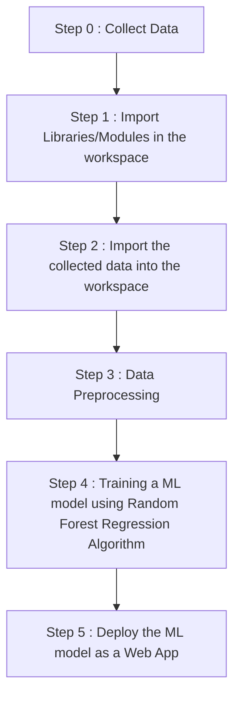

# Medical-Insurance-Cost-Prediction
This Medical Insurance Cost Prediction AI Model Will Predict The Cost Of Any Medical Insurance With Around 84.26 % Accuracy...

Link to the web app : 

<h1 align='center'> Work Flow Of This Project </h1>

